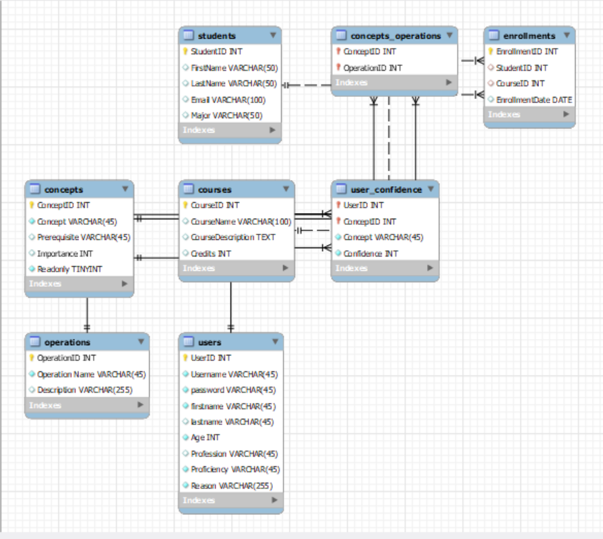

# SQLWizard Chatbot Application

SQL Wizard is a personalized chatbot that emulates an assistant teaching the coding language SQL to a student. The Personalized Chatbot will provide tailored answers to a student's questions about SQL as well as provide an interface for the student to practice SQL on a demonstration database. The chatbot will be personalized as it will build up knowledge (user model) of the students' competence in SQL and provide personalized feedback to the student.

The chatbot utilizes GPT3.5 Turbo API, running as Flask application using HTML/CSS/JS as the front-end. MySQL is used as the database service in the back-end


## Getting Started

These instructions will guide you through setting up and running SQLWizard on your local machine.

### Prerequisites

Before you begin, ensure you have installed:

- Python 3.x
- pip (Python package manager)
- MySQL Server
- An IDE of your choice

### Installation

Follow these steps to set up your development environment:

1. **Clone the repository**

   ```
   git clone https://github.com/vedang01/SQLChatbot.git
   cd path-to-repository
   ```

2. **Set up a Python virtual environment (recommended)**

   ```
   python -m venv venv
   source venv/bin/activate  # On Windows use `venv\Scripts\activate`
   ```

3. **Install dependencies**
   ```
   pip install -r requirements.txt
   ```

### Configuration

1. **Database Configuration**

   Set up your MySQL server and create two databases named `sqlwizard` and `sandbox`.
   

2. **Environment Variables**

   Set the following environment variables in your environment:

   - `DB_PASSWORD`: Your MySQL database password.
   - `OPENAI_API_KEY`: Your OpenAI API key for GPT-3.5 access.
   - `FLASK_SECRET_KEY`: A Flask secret key used for session management.

   On Unix/macOS:

   ```
   export DB_PASSWORD="yourpassword"
   export OPENAI_API_KEY="yourapikey"
   export FLASK_SECRET_KEY="randomsecretkey"
   ```

   On Windows CMD:

   ```
   set DB_PASSWORD=yourpassword
   set OPENAI_API_KEY=yourapikey
   set FLASK_SECRET_KEY=randomsecretkey
   ```

   On Windows PowerShell:

   ```
   $env:DB_PASSWORD="yourpassword"
   $env:OPENAI_API_KEY="yourapikey"
   $env:FLASK_SECRET_KEY="randomsecretkey"
   ```

### Running the Application

1. **Start the Flask server**

   ```
   flask run
   ```

   Or directly with:

   ```
   python app.py
   ```

   The application will be available at `http://127.0.0.1:5500/` by default.

2. **Access the Application**

   Open a web browser and go to `http://127.0.0.1:5500/` to start using the SQLWizard application.

## Usage

After accessing the application through your browser, you can interact with the SQLWizard to learn SQL queries, test your knowledge, and explore SQL concepts in a guided manner. You will be guided through the application via an intro overlay. 

Happy Coding!
